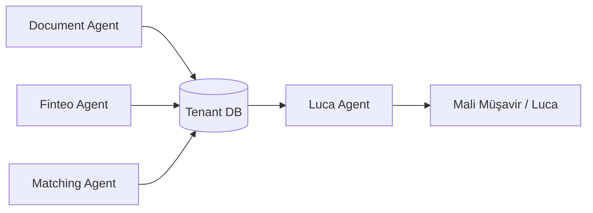

# FINATURA_ROADMAP

> Kıdemli Mali Müşavir bakış açısıyla hazırlanmış, çoklu ajan (Multi-Agent) yapısında, aşama aşama uygulama yol haritası.

---

## Durum özeti (2026-07-15)

### İstemci çatısı (karar)

| Yüzey | Durum | Not |
|-------|--------|-----|
| **Tek çatı Flutter** (`apps/mobile`) | Aktif hedef | Mobil + web aynı Flutter uygulaması → `app.finatura.app` |
| **www** (`apps/web`) | Ayrı | Marketing / landing — ürün UI değil |
| **dashboard** (`apps/dashboard`) | **Frozen** | Yeni özellik yok; Flutter web tek ürün paneli |
| **MM portal** (`apps/accountant-portal`) | Ayrı | Mali müşavir yüzeyi → `mm.finatura.app` |
| **Giriş** | Ayrı host | `login.finatura.app` — kimlik / oturum |

Ayrıntı: [`docs/MIMARI_ISTEMCI.md`](docs/MIMARI_ISTEMCI.md).

### Backend / ürün olgunluğu

Repo’da **şema + servis/paket iskeletleri** geniş yüzeyde duruyor; **production (canlı OCR, gerçek Finteo/entegratör/ödeme, gerçek kamera, tenant DB provisioning)** henüz yok. `database/` SQL şemaları (1.1 / 1.3) teslim edilmiş. Hemen her backend ajanı (`tenant-router`, `document-agent`, `forms-agent`, `einvoice-integrator`, `finteo-agent`, `matching-agent`, `luca-agent`, `billing-agent`, `api-gateway`) ve istemci UI (`apps/mobile` scan/settlement, `apps/accountant-portal`) **çalışır stub/mock veya offline kütüphane** düzeyinde — işaretler `[x] (iskelet)` ile dürüst tutuldu. Entegre SaaS pipeline (gateway → router → ajan → kontör → Luca) uçtan uca bağlı değil.

---

## Proje Tanımı & Mali Müşavir Vizyonu

| Alan | Detay |
|------|--------|
| **Proje adı** | Finatura (`finatura.app`) |
| **Sektörler** | Oto Galeri, Kuyumculuk, Emlak (Gayrimenkul) |
| **Mimari** | Multi-Tenant — her firmaya izole, ayrı PostgreSQL veritabanı |

### Misyon

Esnafın (galerici, kuyumcu, emlakçı) muhasebe yükünü sıfıra indirmek.

- Noter sözleşmesi, kimlik veya tapuyu kamerayla taratıp (**OCR**) saniyeler içinde e-Fatura / Gider Pusulası taslağı hazırlamak
- Banka hareketlerini (**Finteo**) otomatik çekip carilerle eşleştirmek
- Karmaşık genel muhasebe programları yerine günlük ihtiyaca odaklanmak: giren para, çıkan para, noter sözleşmesi / tapu, e-Fatura ve gider pusulası

### Vizyon Notu

Galericilerin noter sözleşmelerini torbalarda taşıdığı, kuyumcuların has altın hesabı için ajandalarında kaybolduğu, emlakçıların tapu fotokopilerini klasörlerde çürüttüğü dünyayı sadeleştirmek. Multi-Tenant (her firmaya izole DB) mimari hem finansal veri güvenliği hem de Luca gibi sistemlere entegrasyon için uygundur.

### İzole DB Mimarisi

Her mükellef / şirket (**Tenant**) kendi bağımsız PostgreSQL veritabanına sahip olacak. Veri güvenliği en üst düzeyde tutulacak. Merkezi DB üyelik, bağlantı bilgileri ve kontör durumunu tutar; iş verisi tenant DB’lerinde kalır.

---

## Çoklu Ajan Mimarisi (Multi-Agent Framework)

Sistem, insan müdahalesine gerek kalmadan arka planda çalışacak **4 ana akıllı ajan** üzerine kuruludur:

| Ajan | Rol |
|------|-----|
| **OCR & Evrak Analiz Ajanı** (`Document Agent`) | Kameradan veya galeriden gelen Noter Sözleşmesi, Tapu ve Kimlik belgelerini okur; verileri yapısal JSON’a çevirir. |
| **Finteo Hesap Takip Ajanı** (`Finteo Agent`) | Banka hesaplarını 7/24 izler; yeni gelen/giden havaleleri veritabanına kaydeder. |
| **Akıllı Eşleştirme Ajanı** (`Matching Agent`) | Banka açıklamalarındaki TCKN, unvan veya plaka gibi bilgileri süzerek ilgili cari ve faturayla otomatik eşleştirme önerisi sunar. |
| **Mali Müşavir Entegrasyon Ajanı** (`Luca Agent`) | Evrak, fatura ve banka hareketlerini dönemsel olarak Luca standartlarında XML/Excel formatına dönüştürüp muhasebeciye hazırlar. |

---

## TODO List & Aşama Aşama Proje Yol Haritası

### AŞAMA 1 — İzole Veritabanı (Multi-Tenant) & Dinamik Yönlendirme Altyapısı

Bu aşamada her firmanın kendi veritabanını dinamik olarak oluşturup yönetecek altyapı kurulur.

- [x] **1.1. Merkezi Router Veritabanı Kurulumu** *(şema hazır; canlı provisioning yok)*
  - [x] Tüm tenant’ların (mükelleflerin) üyelik, veritabanı bağlantı bilgileri (DB Connection String) ve kontör/bakiye durumlarını tutan ana `finatura_central` DB’sinin kurulması
  - Dosyalar: `database/central/01_schema.sql`, `database/central/02_seed_plans.sql`

- [x] **1.2. Dinamik DB Connection Router (PostgREST / Node.js)**
  - [x] Flutter uygulamasından gelen isteklerdeki `X-Tenant-ID` başlığına göre ilgili mükellefin izole veritabanına güvenli bağlantı yönlendirmesi sağlayan yapının kodlanması
  - api-gateway ↔ tenant-router proxy (`/v1/tenant/*`), JWT auth + UserRepository (stub / central iskelet), `password_ciphertext` decrypt hook (stub KMS)
  - Kod: `services/tenant-router/`, `services/api-gateway/`
  - Kalan: gerçek KMS, `public.users` şeması, bcrypt, Redis rate-limit

- [x] **1.3. İzole PostgreSQL Tablo Şemalarının Tasarlanması (Tenant DB Template)** *(şema hazır)*
  - [x] `customer_caris` — Müşteri, alıcı, satıcı ve ortak emlakçı cari kartları (TCKN/VKN, Unvan, İletişim, Adres)
  - [x] `vehicles` — Galericiler için araç envanter tablosu (Plaka, Şase No, Marka, Model, Motor No, Alış/Satış Bedeli, KDV Oranı)
  - [x] `real_estates` — Emlakçılar için portföy tablosu (Ada, Parsel, İl, İlçe, Mahalle, Metrekare, Malik Bilgisi)
  - [x] `veresiye_transactions` — Kuyumcular için döviz ve altın (Has/Gram); galerici ve emlakçılar için TL bazlı borç-alacak takip tablosu
  - [x] `invoices` — e-Fatura, e-Arşiv ve Gider Pusulası taslak kayıtları
  - [x] `bank_accounts` / `bank_transactions` — Finteo için banka hesap ve hareketleri (mimari hazırlık)
  - Dosya: `database/tenant_template/01_schema.sql`
  - Tipler (iskelet): `packages/shared-types/`

---

### AŞAMA 2 — OCR & Evrak Analiz Ajanı (Document Agent) Entegrasyonu

Sözleşme ve belgeleri okuyup sistemi otomatik besleyecek yapay zeka / OCR katmanının kurulması.

- [x] **2.1. Noter Satış Sözleşmesi OCR Parser Modeli** *(iskelet)*
  - [x] Kameradan çekilen noter sözleşmesi görselinden Plaka, Şase No, Satış Bedeli, Alıcı TCKN ve Satıcı TCKN bilgilerini çeken regex ve LLM tabanlı parser’ın yazılması *(iskelet — metin/fixture üzerinde regex + LLM prompt; gerçek görüntü OCR stub)*
  - Kod: `services/document-agent/src/parsers/noter/`

- [x] **2.2. Tapu Senedi OCR Parser Modeli** *(iskelet)*
  - [x] Tapu görselinden İl/İlçe, Ada, Parsel, Yüzölçümü ve Malik bilgilerini otomatik ayıklayan yapının kurulması *(iskelet — metin parser; görüntü OCR yok)*
  - Kod: `services/document-agent/src/parsers/tapu/`

- [x] **2.3. Kimlik / Ehliyet OCR Parser Modeli** *(iskelet)*
  - [x] Yeni cari açarken kimlikten TCKN, İsim-Soyisim ve Doğum Tarihi bilgilerini saniyeler içinde çekip forma dolduran sistemin yazılması *(iskelet — parser + form köprüsü yok)*
  - Kod: `services/document-agent/src/parsers/kimlik/` · Orkestrasyon: `services/document-agent/`

- [x] **2.4. Flutter Kamera & Kenar Algılama UI Modülü** *(iskelet)*
  - [x] Evrakların düzgün taranabilmesi için otomatik kenar algılama (document crop) özellikli kamera ekranının geliştirilmesi *(iskelet — stub kamera + MockEdgeDetection; native plugin bağlı değil)*
  - Kod: `apps/mobile/lib/features/scan/`

---

### AŞAMA 3 — e-Fatura, Gider Pusulası & Akıllı Form Oluşturma

Mali mevzuata uygun belgelerin otomatik üretilmesi ve entegratör üzerinden resmileştirilmesi.

- [x] **3.1. Otomatik Belge Dönüştürücü Sınıflar (Transformers)** *(iskelet — kütüphane hazır; pipeline bağlı değil)*
  - [x] OCR’dan gelen Noter Sözleşmesi verisini tek tıkla e-Fatura (galerici araç satıyorsa) veya Gider Pusulası (galerici şahıstan araç alıyorsa) taslağına dönüştüren kodun yazılması *(iskelet — UBL-TR benzeri taslak; canlı entegratör/DB yazımı yok)*
  - Kod: `packages/invoice-transformers/`

- [x] **3.2. e-Fatura Entegratörü Entegrasyonu** *(iskelet)*
  - [x] EDM, Uyumsoft veya FIT gibi yaygın entegratörlerin API servisleriyle bağlantı kurulup taslakların gönderilmesi, onaylanması ve PDF olarak indirilmesi *(iskelet — ortak arayüz + stub adapter; gerçek HTTP yok)*
  - Not (2026-07): **8 entegratör iskeleti** bağlandı — `edm`, `uyumsoft`, `fit`, `elogo`, `qnb`, `nes`, `nilvera`, `izibiz` (factory / config / bayilik enum / `providerHint`). Live SOAP/REST iskeleti stub ile yan yana; bayilik WSDL inceltilmesi açık.
  - Kod: `services/einvoice-integrator/`

- [x] **3.3. Dijital Maslak / Teslimat / Yer Gösterme Formları** *(iskelet)*
  - [x] Esnafın sahada müşteriye telefondan imzalatarak yasal güvence oluşturacağı PDF şablonlarının (Yer gösterme belgesi, araç kapora formu vb.) kodlanması *(iskelet — HTML şablon + PDF stub; e-imza / tablet imza yok)*
  - Dosya: `services/forms-agent/`

---

### AŞAMA 4 — Finteo Banka Entegrasyonu & Akıllı Eşleştirme Ajanı

Bankaya gelen paralar ile kesilen faturaların muhasebe kurallarına göre otomatik kapatılması.

- [x] **4.1. Finteo API Servis Katmanı** *(iskelet)*
  - [x] Mükellefin tüm banka hesap hareketlerini anlık veya 10 dakikalık periyotlarla izole veritabanındaki `bank_transactions` tablosuna besleyen servisin yazılması *(iskelet — worker + mock Finteo client; canlı API yok)*
  - Kod: `services/finteo-agent/`

- [x] **4.2. Akıllı Eşleştirme Algoritması** *(iskelet)*
  - [x] Banka dekont açıklamasında geçen Plaka, Ada/Parsel veya Müşteri Adı ile veritabanındaki aktif sözleşme ve faturaları eşleştiren algoritmanın geliştirilmesi *(iskelet — sinyal süzme + skor; tenant DB aday çekimi / persist yok)*
  - Kod: `services/matching-agent/`

- [x] **4.3. Tek Tıkla Veresiye Kapatma (Swipe to Settle)** *(iskelet)*
  - [x] Bankaya gelen paraya tıklandığında, tek kaydırma hareketiyle o paranın veresiye defterindeki cari borca mahsup edilmesi arayüzünün yapılması *(iskelet — Flutter UI + mock veri; backend mahsup yok)*
  - Kod: `apps/mobile/lib/features/settlement/`

---

### AŞAMA 5 — Mali Müşavir Entegrasyon Ajanı (Luca & Muhasebe Köprüsü)

Muhasebecileri sisteme dahil edip onların da işini kolaylaştırarak satışı hızlandırmak.

- [x] **5.1. Luca XML Export Servisi** *(iskelet)*
  - [x] Sistemde biriken tüm e-Faturaları, gider pusulalarını ve banka hareketlerini Luca’nın doğrudan “Fiş Aktarımı” kısmından okuyabileceği yevmiye fişi formatında XML olarak dışa aktarma modülü *(iskelet — offline XML dönüştürücü; tenant DB / portal indirme hattı yok)*
  - Kod: `services/luca-agent/`

- [x] **5.2. Mali Müşavir Portal Ekranı** *(iskelet)*
  - [x] Sadece mükellefin mali müşavirinin girebileceği; aylık fatura listesini, gider pusulalarını ve banka mutabakatlarını tek ekranda görüp toplu olarak onaylayabileceği sade bir web paneli *(iskelet — Vite/React mock UI; API/auth yok)*
  - Kod: `apps/accountant-portal/`

---

### AŞAMA 6 — Bakiye, Kontör & Abonelik Modülü

Kullanım bazlı gelir modelinin sisteme kurulması.

- [x] **6.1. Kontör Takip Sistemi** *(iskelet)*
  - [x] Mükellefin yaptığı her OCR sorgusu (sözleşme / kimlik / tapu) ve her başarılı e-fatura gönderiminde bakiyesinden düşecek kredi takip sisteminin yazılması *(iskelet — ledger/debit API; OCR/e-fatura çağrılarına canlı bağlı değil)*
  - Kod: `services/billing-agent/src/kontor/`

- [x] **6.2. Kolay Ödeme Geçidi (Payment Gateway)** *(iskelet)*
  - [x] Esnafın uygulama içinden kredi kartıyla hızlıca kontör/paket satın alabileceği altyapının kurulması *(iskelet — checkout/webhook + stub gateway; İyzico/PayTR yok)*
  - Kod: `services/billing-agent/src/payment/`

---

## İlk Kurulum Talimatı (Cursor AI)

Composer (`Cmd+I` / `Ctrl+I`) ile projeyi şu talimatla başlatın:

> `FINATURA_ROADMAP.md` dosyasındaki **AŞAMA 1 (1.1 ve 1.3)** adımlarını uygulamaya başla. Bana central veritabanı şemasını ve her yeni üye firma için kurulacak izole `tenant_template` SQL şemasını oluştur.

---

## Aşama Özeti

| Aşama | Odak | Bağımlılık | Kod durumu (2026-07-15) |
|-------|------|------------|-------------------------|
| 1 | Multi-Tenant DB & router | — | Şema hazır; router iskelet |
| 2 | OCR / Document Agent | Aşama 1 | Parser + kamera UI iskelet; gerçek OCR yok |
| 3 | e-Fatura & formlar | Aşama 1–2 | Transformers + stub entegratör + form HTML iskelet |
| 4 | Finteo & eşleştirme | Aşama 1, 3 | Mock Finteo + matching lib + settlement UI iskelet |
| 5 | Luca / mali müşavir köprüsü | Aşama 3–4 | XML export + mock portal iskelet |
| 6 | Kontör & abonelik | Aşama 1 + canlı kullanım | Billing API iskelet; gerçek ödeme yok |

---

*Bu dosya Finatura SaaS yol haritasının tek kaynak gerçeğidir. Uygulama durumunu güncellerken ilgili checkbox’ları işaretleyin. `[x] (iskelet)` = kod/varlık var, production değil; yanıltıcı tam-tamam işareti kullanmayın.*
