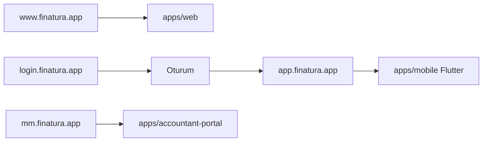

# İstemci mimarisi (host → repo)

Kısa harita: hangi domain hangi uygulamaya bakıyor. Ürün paneli **tek Flutter çatısı**; marketing, giriş ve mali müşavir yüzeyi ayrı.

| Host | Rol | Repo | Durum |
|------|-----|------|--------|
| `www.finatura.app` | Marketing / landing | `apps/web` | Ayrı (Vite) |
| `login.finatura.app` | Kimlik / oturum (giriş–kayıt) | *auth yüzeyi* (Flutter veya ortak login) | Ayrı host |
| `app.finatura.app` | Esnaf ürün UI (mobil + web) | `apps/mobile` (Flutter tek çatı) | Aktif hedef |
| `mm.finatura.app` | Mali müşavir portalı | `apps/accountant-portal` | Ayrı |

## Kurallar

1. **Tek çatı Flutter** — mobil ve web ürün arayüzü `apps/mobile` üzerinden; yeni panel özelliği buraya gider.
2. **www ayrı** — landing/pazarlama; ürün akışı (`tara`, cari, mutabakat, e-fatura) Flutter’da.
3. **dashboard frozen** — `apps/dashboard` donduruldu; yeni iş yok, referans/iskelet olarak kalabilir.
4. **MM portal ayrı** — muhasebeci akışı (`apps/accountant-portal`) esnaf uygulamasından bağımsız host.

Yol haritası üst durum: [`FINATURA_ROADMAP.md`](../FINATURA_ROADMAP.md#durum-özeti-2026-07-15).
